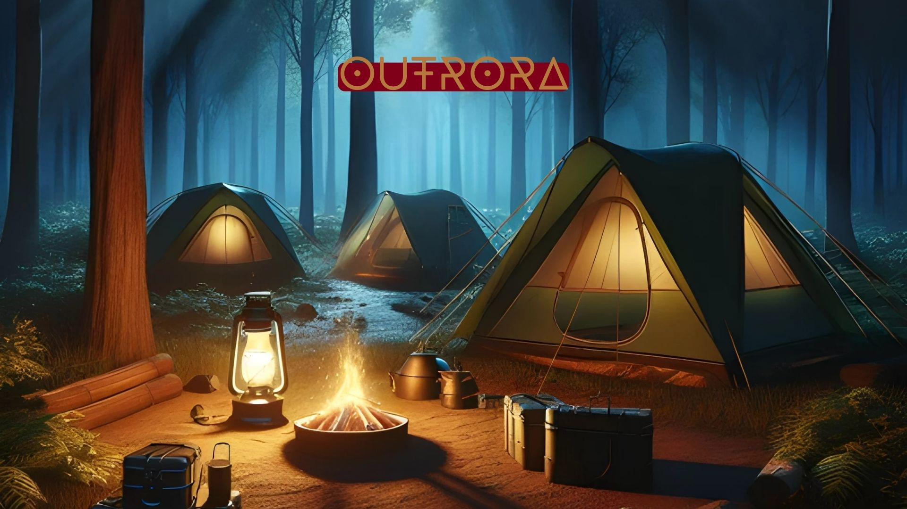
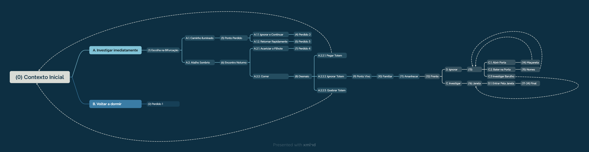

# Outrora

Projeto elaborado como componente da disciplina PISI I (Projeto Interdisciplinar de Sistemas de Informação I).

## Descrição do Projeto

O projeto é um RPG interativo no qual as escolhas do jogador influenciam o desenvolvimento da história.

## Framework

O jogo foi criado utilizando as bibliotecas Kivy e KivyMD.

## Narrativa

Utilizei o Xmind para elaborar o mapeamento da narrativa do jogo.

## Licença

Este projeto está licenciado sob a [Apache License 2.0](LICENSE).
